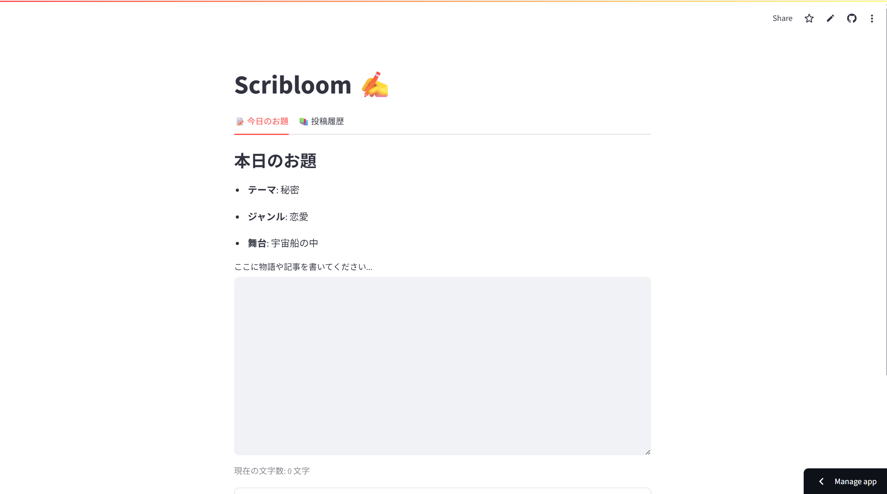

# ✍️ Scribloom


**毎日のお題で創作を習慣にする、シンプルな創作支援アプリ。**  
日替わりのお題に沿って文章を書き、保存・振り返りができることで、創作を「続けられる」体験に変えます。

---

## 🔗 公開デモ

👉 [https://scribloom-ezvsuisqzzsqncvzvbsevd.streamlit.app](https://scribloom-ezvsuisqzzsqncvzvbsevd.streamlit.app)  
> ブラウザだけで起動し、インストール不要です。

---

## 🚀 主な機能

- 📅 日替わりのお題生成（テーマ・ジャンル・舞台）
- 📝 Markdown対応の執筆エリア（文字数カウント付き）
- 💾 投稿の保存と履歴表示（日付順に展開）
- 🧪 ユニットテスト完備（prompt / storage の正常系・異常系）

---

## 🖼️ 使用イメージ

Scribloom の執筆画面では、Markdownプレビューと文字数カウント付きで快適に創作できます。



---

## 🛠 セットアップ方法

```bash
poetry install
poetry run streamlit run frontend/main.py
```

> Python 3.10 以上が必要です。

---

## 🧪 テスト実行

```bash
poetry run pytest --cov=app tests/
```

> `pytest-cov` がインストールされていることをご確認ください。

---

## 📁 ディレクトリ構成

```
.
├── app/           # アプリケーションのロジック
│   ├── core/      # お題生成
│   ├── models/    # スキーマ定義
│   └── services/  # ストレージ操作
├── frontend/      # Streamlit UI
├── data/          # 投稿データ（JSON）
├── tests/         # ユニットテスト
├── images/        # スクリーンショット等の補助資料
├── docs/          # 設計思想や構造など補足ドキュメント
├── README.md
├── pyproject.toml
```

---

## 📘 詳細ドキュメント

Scribloom の設計・構造・処理フローについては、以下のドキュメントをご参照ください。

- [構造とモジュールの責務](docs/structure.md)
- [処理の流れとデータ構造](docs/dataflow.md)
- [設計思想と技術選定](docs/design.md)
- [更新履歴](docs/changelog.md)

👉 Web形式で閲覧できる [Scribloom Docs（GitHub Pages版）](https://eyamagishi.github.io/scribloom/) はこちら

---

## 📌 今後の展望

- 💾 自動保存機能（下書き保持と保存警告）
- 🔍 履歴の検索・フィルタ（ジャンルやキーワード）
- 🔁 お題の再生成オプション
- 🧠 GPTによる創作ヒント提案
- 🌙 ダークモード対応
- 📣 フィードバックフォームの設置

---

## 🧭 使用例（こんな人におすすめ）

- **毎日の執筆習慣をつけたい人**  
  → テーマ付きで迷わず始められます。

- **創作活動のアイデアメモとして使いたい人**  
  → 短く書いて履歴に残せます。

- **創作仲間と共有したい人**  
  → JSONデータをブログやSNSに展開可能です。

---

## 🧑‍💻 開発者向けメモ

- Poetry による依存管理を採用
- Streamlit Cloud でデプロイ＆公開済み
- `.gitignore` にキャッシュ／秘匿情報の除外設定あり
- モジュールとテストには docstring を整備済み
- 🔗 [貢献ガイドはこちら](CONTRIBUTING.md)

## 🧪 テスト実行方法

```bash
poetry run pytest -v
```

カバレッジを確認する場合は以下を使用します：

```bash
poetry run pytest --cov=app --cov-report=term-missing
```

> `pytest-cov` がインストールされていることをご確認ください。

---

## 📦 除外ファイル（.gitignore ポリシー）

以下のファイル・ディレクトリは Git 管理対象外です：

- Python キャッシュ・一時ファイル：`__pycache__/`, `*.pyc`, `*.log`, `*.sqlite3`
- テスト成果物：`.pytest_cache/`, `.coverage`, `htmlcov/`
- 機密情報：`.env`, `.streamlit/secrets.toml`
- 投稿データ：`data/posts.json`（ローカル保存用）
- IDE 設定：`.vscode/`

> 📌 `images/` ディレクトリは除外していません。スクリーンショット等はそのままコミット対象です。

---

## ⚙️ 開発環境構成

| 項目         | 内容                         |
|--------------|------------------------------|
| Python       | 3.10 以上                     |
| パッケージ管理 | Poetry                       |
| テスト       | pytest / pytest-cov           |
| 実行方法     | `poetry run streamlit run frontend/main.py` |
| モジュール構成 | `app/`, `tests/`, `docs/` など |

> 初回セットアップには `poetry install` を使用してください。
